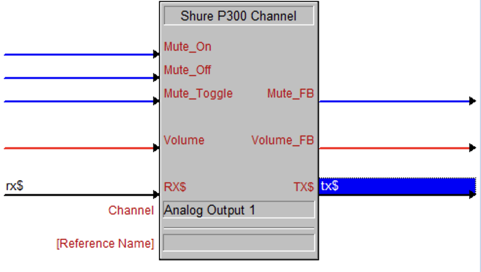
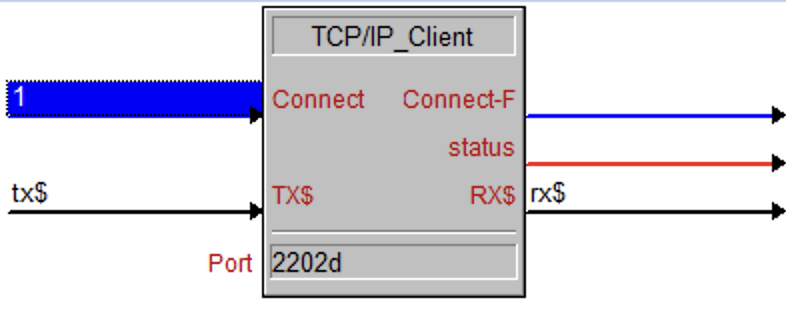

# Shure P300 Crestron Module
Module to control selected input/output channel on a Shure P300.

Volume input and feedback is now scaled to 0-100% (0-65535).

Use with a TCP/IP Client module at port 2202

